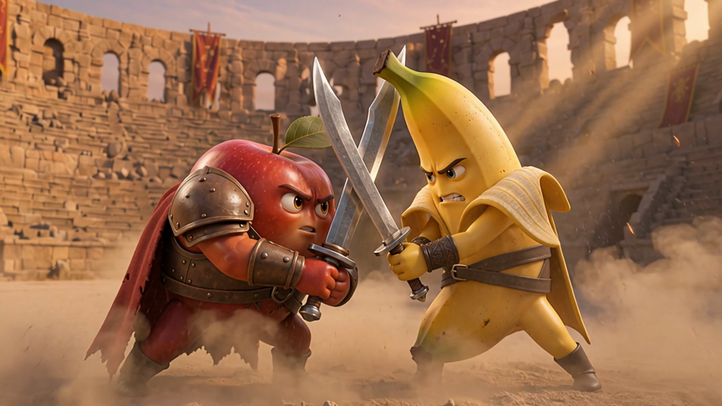
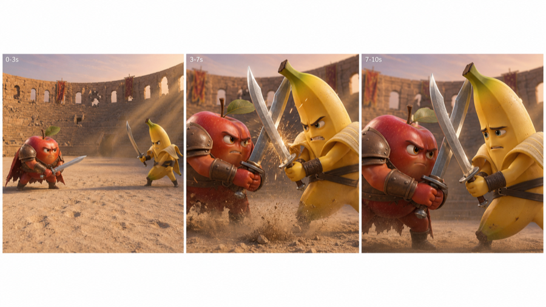

# Reel Video

**Tell your coding agent a story. Get a short film back.**

<p align="center">
  <a href="https://github.com/WannaBeSolopreneur/reel-video/actions/workflows/ci.yml"></a>
  <a href="https://www.npmjs.com/package/reel-video"></a>
  <a href="LICENSE"></a>
  
  <a href="https://github.com/WannaBeSolopreneur/reel-video/stargazers"></a>
</p>

<p align="center">
  
</p>

<p align="center">
  <em>&quot;A Pixar-style apple and banana in an epic sword fight, with narration and dialogue.&quot;<br />
  Three scenes, 30 seconds, spoken lines. Nothing was edited by hand.</em>
</p>

---

## What it is

You describe a story to your coding agent. The agent builds the shots, you press
Generate, and you get video with sound.

- **You talk, it builds.** No timeline, no keyframing, no editor to learn.
- **Nothing drifts.** Characters and sets are locked once and reused in every shot.
- **It stays yours.** Runs on your machine, files on your disk, no new subscription.

Works with Claude Code, Codex, Cursor, Grok Build, and any agent that can run a
terminal. Uses the Grok login you already have.

---

## Quick start

```bash
npx reel-video init "my short"
npx reel-video serve
```

That opens a review board in your browser:

<p align="center">
  
</p>

Then tell your agent what you want:

> *Make a Pixar-style short about an apple and a banana having a sword fight.*

The agent writes the shots. You click Generate.

**Before your first run:**

```bash
grok login          # images and video
brew install ffmpeg # required — see Requirements
```

Video also needs one setting turned on once: run `grok`, type `/privacy`, and
opt in to coding data retention. Without it, images work and video fails.

Want your agent to know the whole workflow? Install the skill:

```bash
mkdir -p ~/.claude/skills/reel-video   # or ~/.grok/skills, ~/.agents/skills
cp -R .grok/skills/reel-video/* ~/.claude/skills/reel-video/
```

---

## How it works

Three ideas. That's the whole tool.

```text
1. LOCKS     one picture of your cast, one of your set
                    │
2. SCENE     one strip of 3 panels — start, middle, end
                    │
3. VIDEO     those 3 panels become a 6 or 10 second clip
```

**Locks** are the visual bible. Every later shot points back at them, which is
why your apple looks like the same apple in scene four.

**A scene is one image, not three.** The model draws a single 3-panel strip, and
Reel Video slices it into your start, middle, and end frames with ffmpeg. One
generation instead of three, and the three frames can't disagree with each other.

<p align="center">
  
</p>

**Then it moves.** Those three frames become one continuous clip with dialogue,
score, and sound. Clips are 6 or 10 seconds — a longer story means more scenes,
which `canvas stitch` joins into one film.

---

## Commands

Your agent runs these. You rarely type them.

| Command | What it does |
|---|---|
| `reel-video init [name]` | Start a project |
| `reel-video serve` | Open the review board |
| `reel-video add image --role character\|location` | Make a lock |
| `reel-video scene add --name "…"` | Build a scene: strip, frames, video |
| `reel-video run` | Generate everything pending |
| `reel-video stitch` | Join scenes into one film |
| `reel-video status` | See what's done |

`canvas` works as a shorter alias. Add `--json` for machine-readable output.

Working from a clone? Prefix with `npm run canvas --`.

---

## Requirements

| Need | Why | Required |
|---|---|---|
| **Node 20+** | Runtime | Yes |
| **ffmpeg** | Slices strips into frames, joins scenes | Yes |
| **Grok login** | Images and video | To generate |
| **Codex login** | Alternate stills provider | Optional |

**ffmpeg is not optional.** Scene frames are ffmpeg crops, so without it a scene
can't produce frames or video. `init` checks and stops if it's missing.

```bash
brew install ffmpeg            # macOS
sudo apt install ffmpeg        # Debian / Ubuntu
sudo dnf install ffmpeg        # Fedora
winget install Gyan.FFmpeg     # Windows
```

No API keys. Auth is your `grok login` session (or `XAI_API_KEY` if you prefer).
Generation bills to your existing Grok plan — Reel Video adds no meter of its own.

---

## When something breaks

| Problem | Fix |
|---|---|
| Video fails, mentions `upload_url` or ZDR | `grok` → `/privacy` → opt in ([details](docs/zdr.md)) |
| `ffmpeg is required` | Install it (above) |
| Characters look different between scenes | Both locks must be ready before adding scenes |
| Want a longer clip | Add another scene — 10 seconds is the per-clip max |
| Codex made no image | `codex login`, then Generate again |

Images usually still work when video is blocked.

---

## FAQ

**Is it free?** The tool is MIT. Generation uses your own Grok and Codex accounts.

**Where do my files go?** `canvas/assets/` for media, `canvas/project.json` for
structure. All local.

**Can I make a 60 second video?** Yes, as six scenes. Individual clips are capped
at 10 seconds by the model.

**Does it replace CapCut or Remotion?** No. This is a storyboard-locked canvas
for generated shots, not an editor or a motion-graphics framework.

**Which agents work?** Anything that can run shell commands and read a skill file.

---

## Contributing

```bash
git clone https://github.com/WannaBeSolopreneur/reel-video.git
cd reel-video && npm install
npm test && npm run typecheck
```

Tests never call a model. Early project — expect rough edges, and issues are
welcome.

Rules agents follow: [`.grok/skills/reel-video/SKILL.md`](.grok/skills/reel-video/SKILL.md)
· Privacy and ZDR: [docs/zdr.md](docs/zdr.md)
· Design notes: [docs/design.md](docs/design.md)

---

## License

[MIT](LICENSE)
