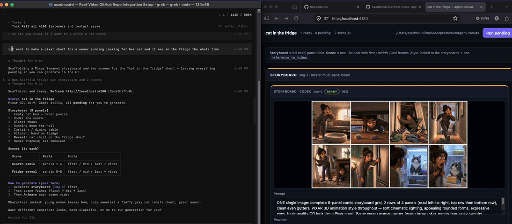
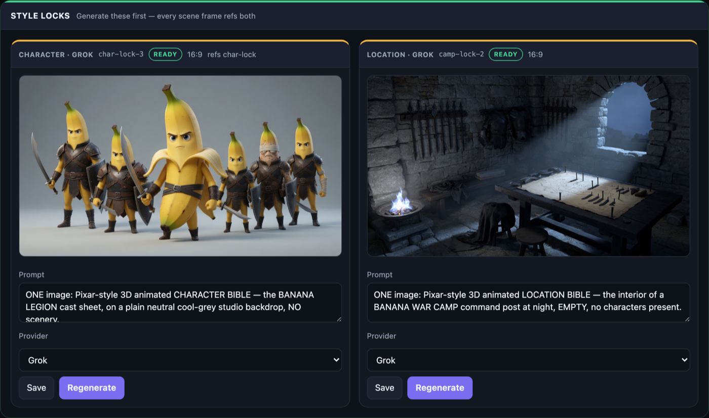
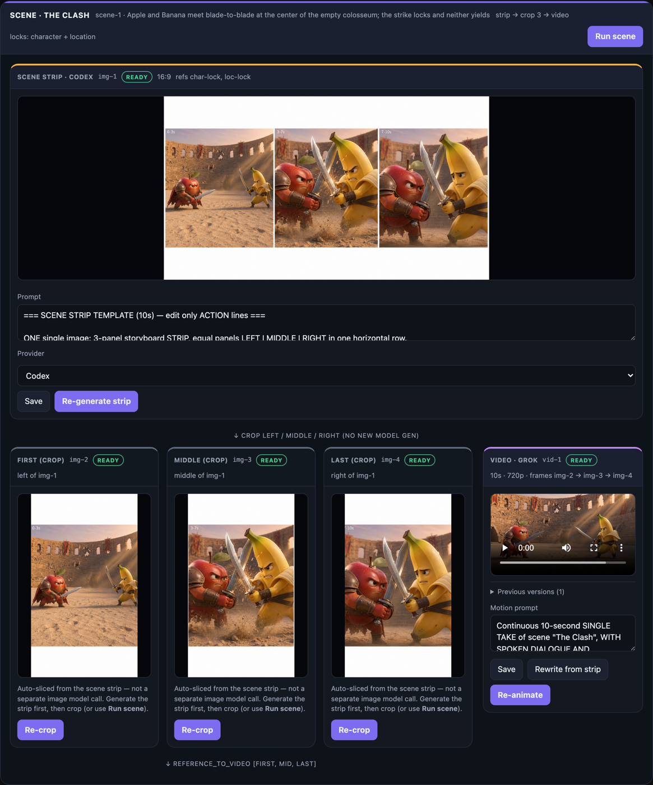
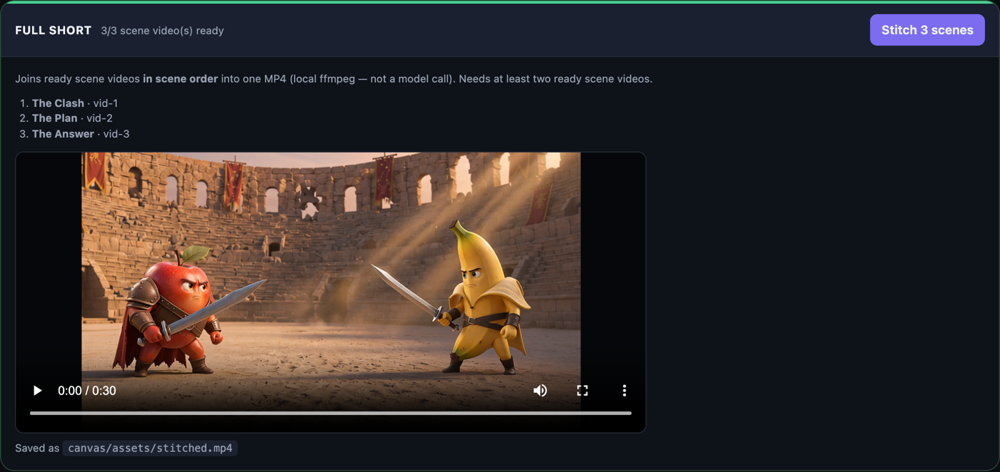
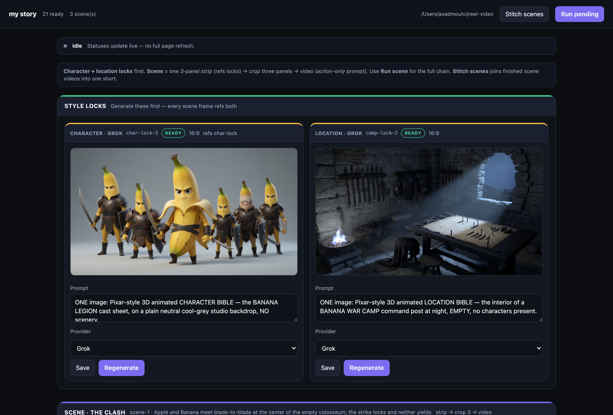

# Reel Video

**Reel Video is an open-source AI video canvas for coding agents.**

It lets Claude Code, Codex, Cursor, Grok Build, and other coding agents turn a plain-language idea into a storyboard, scene keyframes, and short AI-generated videos.

Reel Video runs locally, uses your existing Grok Build and optional Codex login, and does not require separate API keys or another AI subscription.

No new subscription. No second token bill. Files stay on your machine.

<p align="center">
  <a href="#quick-start"><strong>Quick start</strong></a>
  &nbsp;·&nbsp;
  <a href="#how-does-reel-video-work">How it works</a>
  &nbsp;·&nbsp;
  <a href="#how-to-use-reel-video-with-an-agent">Use with an agent</a>
  &nbsp;·&nbsp;
  <a href="#faq">FAQ</a>
  &nbsp;·&nbsp;
  <a href="LICENSE">MIT</a>
</p>

<p align="center">
  <a href="https://github.com/WannaBeSolopreneur/reel-video/actions/workflows/ci.yml"></a>
  <a href="https://www.npmjs.com/package/reel-video"></a>
  <a href="LICENSE"></a>
  
  <a href="https://github.com/WannaBeSolopreneur/reel-video/stargazers"></a>
</p>

---

<p align="center">
  
</p>

<p align="center">
  <em>Prompt: &quot;I want to make a pixar short for a owner running looking for her cat and it was in the fridge the whole time&quot;</em>
</p>

<p align="center">
  
</p>

<p align="center">
  <em>Local review board. The agent scaffolds. You review and generate.</em>
</p>

---

## What is Reel Video?

Reel Video is a local-first TypeScript CLI and browser review interface for agent-driven AI video creation.

The workflow is:

```text
Idea → Storyboard → Scenes → First / Middle / Last Frames → AI Video
```

- **Grok Build** generates images and 6- or 10-second videos.
- **Codex** can optionally generate storyboard and scene stills.
- **Your coding agent** runs the CLI, scaffolds the project, and keeps prompts editable.
- **You** review in the browser and decide what to generate.

Reel Video is not a hosted AI video SaaS. It is an open-source canvas that sits on tools you already use.

---

## Who is Reel Video for?

Reel Video is for people who:

- Already use a coding agent (Claude Code, Codex, Cursor, Grok Build, and similar)
- Already pay for Grok Build and/or Codex
- Want short, style-locked clips from a storyboard instead of one-off chat generations
- Want project files on disk (`canvas/project.json`) that an agent can edit and a human can review

If you want a chat box that returns one mystery clip, this is not that product. If you want an agent to structure a short and leave you a review board, this is.

---

## How does Reel Video work?

```text
Character lock  (cast bible)   ─┐
Location lock   (set bible)    ─┴─ generate these first
   └── Scene (~6 or 10 second beat)
         ├── strip            ONE 3-panel still, refs both locks
         ├── first/mid/last   crops of the strip (ffmpeg, no model call)
         └── video            Grok reference_to_video on those three crops
```

1. The agent generates a **character lock** and a **location lock**. These are the visual bible.
2. The agent adds **scenes**. Each scene is one short chapter of the story.
3. Each scene generates **one 3-panel strip** that references both locks.
4. The strip is **auto-sliced** into first / middle / last frames. No extra model call.
5. Grok turns those three frames into a **6s or 10s** video.
6. Longer stories use more scenes, not longer single clips.

Media lands in `canvas/assets/`. State lives in `canvas/project.json`. Both stay local.

### The locks come first

Every scene frame references both locks, which is what keeps the cast and the set
from drifting between shots.

<p align="center">
  
</p>

### One strip becomes three frames and a video

The strip is the only model call in a scene. The three frames below it are ffmpeg
crops of that same image, so they cost nothing and cannot drift from each other.

<p align="center">
  
</p>

### Scenes stitch into one short

`canvas stitch` joins finished scene videos in scene order with local ffmpeg.
Audio survives the join.

<p align="center">
  
</p>

---

## Does Reel Video cost extra?

**No separate Reel Video subscription and no Reel Video API keys.**

You pay for the providers you already use:

| What | Provider | How you auth |
|---|---|---|
| Images + video | xAI Imagine API | `grok login` (session) or `XAI_API_KEY` |
| Optional stills | Codex | `codex login` |
| This repo | Open source (MIT) | Free |

Provider plan limits still apply. Reel Video does not add a second token meter on top.

---

## Quick start

One-time setup on your machine. After that, open the repo in your agent and talk in plain language.

### 1. Install Reel Video

```bash
npx reel-video init "my short"
```

That is the whole install. To hack on Reel Video itself, clone it instead:

```bash
git clone https://github.com/WannaBeSolopreneur/reel-video.git
cd reel-video
npm install
```

#### Requirements

| Requirement | Why | Required? |
|---|---|---|
| **Node 20+** | Runtime | Yes |
| **ffmpeg** (with `ffprobe`) | Slices the scene strip into frames, and joins scenes in `canvas stitch` | Yes |
| [Grok Build](https://grok.x.ai/) CLI | `grok login` for images + video (or set `XAI_API_KEY`) | For generating |
| [Codex](https://openai.com/codex) CLI | Optional alternate stills provider | No |

**ffmpeg is not optional.** Scene frames are ffmpeg crops of the scene strip, so
without it a scene cannot produce frames or video. `canvas init` checks for it and
stops if it is missing.

```bash
brew install ffmpeg                  # macOS
sudo apt install ffmpeg              # Debian / Ubuntu
sudo dnf install ffmpeg              # Fedora
winget install Gyan.FFmpeg           # Windows
```

On macOS without ffmpeg, Reel Video falls back to `sips` for crops — frames work,
but `canvas stitch` does not.

### 2. Log in once

```bash
grok login          # required for images + video
codex login         # optional stills
```

### 3. Enable Grok video once

Video generation needs coding-data retention opted **in**. Use the interactive Grok app (not `grok -p`):

```bash
grok
# type: /privacy
# Coding data, retention, and training → Opt in
```

Details: [docs/zdr.md](docs/zdr.md)

### 4. Install the agent skill

So Claude Code, Grok, Codex, Cursor, and similar tools load the workflow:

```bash
# Grok Build
mkdir -p ~/.grok/skills/reel-video
cp -R .grok/skills/reel-video/* ~/.grok/skills/reel-video/

# Claude Code
mkdir -p ~/.claude/skills/reel-video
cp -R .grok/skills/reel-video/* ~/.claude/skills/reel-video/

# Codex / agent skills home
mkdir -p ~/.agents/skills/reel-video
cp -R .grok/skills/reel-video/* ~/.agents/skills/reel-video/
```

Skill file: [`.grok/skills/reel-video/SKILL.md`](.grok/skills/reel-video/SKILL.md)

### 5. Open the repo in your coding agent

Point your agent at this project. You are ready to make a short.

---

## How to use Reel Video with an agent

### What you say

```text
Open this reel-video project, serve the canvas, and make a Pixar short
about an owner looking for her cat who was in the fridge the whole time.
```

Or:

```text
Scaffold a new short: 8-panel storyboard and two 6-second scenes.
Leave shots pending so I can generate in the UI.
```

Demo prompt from the GIF above:

```text
I want to make a pixar short for a owner running looking for her cat
and it was in the fridge the whole time
```

### What the agent does

1. Runs `canvas init` if needed  
2. Starts **`canvas serve`** (review UI at http://localhost:4180)  
3. Scaffolds storyboard + scenes with the CLI  
4. Leaves shots **pending** unless you ask it to generate  
5. Tells you to refresh the board and click Generate  

### What you do

1. Review prompts in the browser  
2. Generate in order: locks → scene strip → scene video  
3. Ask the agent for the next scene when the look is right  

Preferred loop: **agent scaffolds, human generates in the UI.** Only run full `canvas run` when you ask the agent to.

Run `canvas serve` and you get the review board. Every prompt is editable in place,
and each card has its own Generate button, so nothing is spent until you click it.

<p align="center">
  
</p>

---

## What commands does the agent run?

You usually do not type these. Your agent does.

Installed from npm, the command is `reel-video` (or the shorter `canvas` alias):

```bash
reel-video init "my short"
reel-video serve

# 1. the visual bible — both locks first
reel-video add image --role character --provider grok --aspect 16:9 --id char-lock \
  --prompt "ONE image: character bible, cast lineup, consistent design … NO text"
reel-video add image --role location --provider grok --aspect 16:9 --id loc-lock \
  --prompt "ONE image: location bible, empty establishing set … NO text"

# 2. scenes reference both locks
reel-video scene add --name "The Clash" --duration 10 --provider grok

reel-video status
reel-video stitch
```

Working from a clone instead, prefix with `npm run canvas --` (for example
`npm run canvas -- init "my short"`).

| Command | Purpose |
|---|---|
| `canvas init [name]` | Create `canvas/project.json` (checks for ffmpeg) |
| `canvas serve` | Open the local review UI |
| `canvas lock character\|location <id>` | Mark the cast / set bible |
| `canvas scene add --name …` | Scaffold strip + 3 crops + video |
| `canvas add image` / `add video` | Free shots |
| `canvas stitch` | Join ready scene videos into one MP4 |
| `canvas set` / `rm` / `run` / `status` | Edit, remove, generate, inspect |

Add `--json` for machine-readable output. Exit codes: `0` success, `1` failure, `2` usage error.

---

## Rules for agents

Source of truth: [`.grok/skills/reel-video/SKILL.md`](.grok/skills/reel-video/SKILL.md)

1. Serve the UI first. Do not unprompted `canvas run` while the human is generating in the browser.  
2. Keep scene frames referenced to the storyboard so style does not drift.  
3. `reference_to_video` takes **images only** (2-7 stills), never prior `.mp4` files.  
4. Video duration is only **6 or 10** seconds. Longer story means more scenes.  
5. Never invent tunnels or public upload endpoints for ZDR. See [docs/zdr.md](docs/zdr.md).  
6. Commit `canvas/project.json`. Media under `canvas/assets/` is gitignored.  

---

## FAQ

### Is Reel Video free?

The software is free and open source under the [MIT license](LICENSE). Image and video generation use your Grok Build and optional Codex accounts. There is no Reel Video usage meter.

### Do I need API keys?

No. Auth is `grok login` (session token in `~/.grok/auth.json`) or `XAI_API_KEY`, and optional `codex login` for Codex stills. Video/image for Grok go to `api.x.ai` directly — not `grok -p`.

### Where do videos and images go?

On your machine under `canvas/assets/`. Project structure is `canvas/project.json`.

### Can I make videos longer than 10 seconds?

Not as one clip. Add another scene. Each video shot is 6 or 10 seconds only.

### Why did video fail with output.upload_url or ZDR?

Most personal accounts need coding-data retention opted in via `grok` → `/privacy`. Team Zero Data Retention may need S3/R2 config. See [docs/zdr.md](docs/zdr.md).

### Which coding agents work with Reel Video?

Any agent that can run shell commands and read the skill: Claude Code, Codex, Cursor, Grok Build, and similar tools.

### Is this a replacement for Remotion or CapCut?

No. Reel Video is an agent-operated canvas for AI stills and short generative clips with a storyboard lock. It is not a full NLE or motion-graphics framework.

---

## If video fails

| Problem | Fix |
|---|---|
| `output.upload_url` / ZDR | `grok` → `/privacy` → Opt in ([docs/zdr.md](docs/zdr.md)) |
| Team ZDR on | Admin configures R2/S3 in `~/.grok/config.toml` |
| Style drifts across shots | Always ref the storyboard (`scene add` does this) |
| Need a longer story | Add another scene |
| Codex wrote no image | `codex login`, re-Generate in the UI |

Images often still work when video is blocked. Reel Video never invents a public tunnel for you.

---

## Safety

Grok stills use **`grok-imagine-image-quality`**; video uses **`grok-imagine-video-1.5`** via the Imagine REST API (`/images/*`, `/videos/generations` with `reference_images`). No `grok -p` agent loop.

More: [docs/zdr.md](docs/zdr.md) · [docs/design.md](docs/design.md)

---

## Develop

```bash
npm test
npm run typecheck
```

Tests do not call the model. Early project: Grok + Codex stills, Grok video after privacy opt-in.

## License

[MIT](LICENSE)
